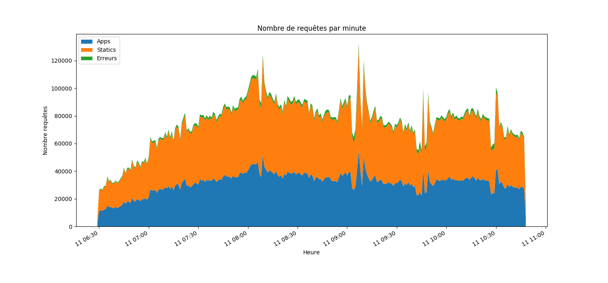
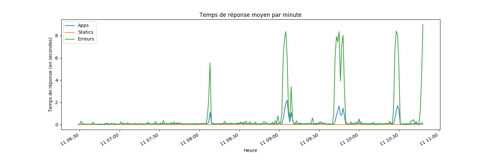

Analyse logs nginx
==================

Ce dépôt a pour but de tester différentes solution pour parser des fichiers de logs volumineux (plusieurs Go). Ceci afin de charger un DataFrame Pandas pour faire quelques analyses et visualisations.

Avec des fichiers de taille plus réduite, on aurait pu directement charger le fichier dans pandas avec la fonction read_csv comme le montre l'extrait ci-dessous. Mais, pour des fichiers de plusieurs Giga ça nécessite trop de mémoire.

```python
import pandas as pd

df = pd.read_csv('logs/access.log',
        sep=r'\s(?=(?:[^"]*"[^"]*")*[^"]*$)(?![^\[]*\])',
        engine='python',
        usecols=[0, 3, 4, 5, 6, 7, 8, 9],
        names=['ip', 'date', 'request', 'status', 'size', 'referer', 'user_agent', 'rt'],
        na_values='-',
        header=None)
```

Nous cherchons à visualiser le nombre de requêtes (applicatives, fichiers statiques et en erreurs) et le temps de réponse moyen. Nous allons faire une aggrégation des requêtes par tranches d'une minute et les stocker dans un dictionnaire python qui pourra être chargé dans un DataFrame Pandas.

Installation
------------

``` bash
python3 -m venv .venv
source .venv/bin/activate
pip install pip --upgrade
pip install pandas matplotlib
```

Execution
---------

```bash
time python analyse-logs-fullpy.py logs/access.log.gz
time python analyse-logs-regex.py logs/access.log.gz
cd c
make
cd ..
time python analyse-logs-c.py logs/access.log.gz
cd go
make
cd ..
time python analyse-logs-go.py logs/access.log.gz
cd rust/parse_logs
cargo build --release
cd ../..
time python analyse-logs-rust.py logs/access.log.gz
```

Temps d'executions
------------------

### Fichier non compressé

| Version | Real | User | Sys |
|---------|------|------|-----|
| python seul | 0m50.854s | 0m48.464s | 0m3.296s |
| python regex | 1m51.732s | 1m49.416s | 0m3.044s |
| python + extension C pour le parsing des logs | 0m13.125s | 0m8.208s | 0m3.496s |
| python + extension Go pour le parsing des logs | 0m14.118s | 0m11.556s | 0m4.116s |
| python + extension Rust pour le parsing des logs | 0m30.097s | 0m27.524s | 0m3.008s |

### Fichier gzip

| Version | Real | User | Sys |
|---------|------|------|-----|
| python seul | 1m9.016s | 1m9.088s | 0m1.256s |
| python regex | 2m11.410s | 2m11.484s | 0m1.396s |
| python + extension C pour le parsing des logs | 0m17.375s | 0m17.380s | 0m1.280s |
| python + extension Go pour le parsing des logs | 0m21.743s |  0m22.936s | 0m1.500s |
| python + extension Rust pour le parsing des logs | 0m34.038s |  0m34.176s | 0m1.212s |

Résultat
--------

Le script produit deux images dans `/tmp` représentant le nombre de requêtes et le temps de réponse.



